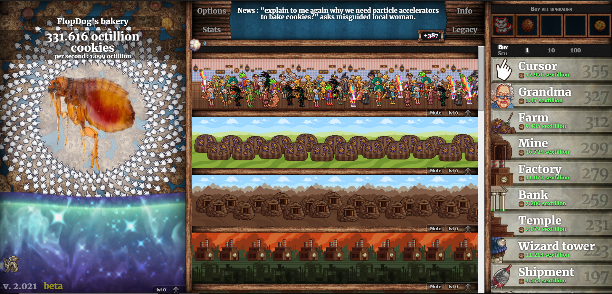

# Website on Github Pages:

https://flopd0g.github.io/Flea-Clicker/

# Version 0.1.0:

# The Overall Idea:

# Version 0.4.0:

## Added:
##### Command Prompt
##### Better UI
##### Added a fast mode
##### Cleaned up code
## Command Prompt:
##### "fleas": fleas_owned,
##### "catcost": catCost,
##### "catsowned": catsOwned,
##### "dogcost": dogCost,
##### "dogsowned": dogsOwned,
##### "bloodcost": bloodCost,
##### "bloodowned": bloodOwned,
##### "catfoodcost": catMultiplierCost,
##### "catfoodowned": catsMultiplierOwned,
##### "dogfoodcost": dogMultiplierCost,
##### "dogfoodowned": dogsMutliplierOwned,
##### "clickpower": clickPower,
##### "totalclicks": totalClicks,
##### "fps": fps,
##### "fastmode": fastmode,
##### "save": save,
##### "clickpower": clickPower,
##### "totalclicks": totalClicks
